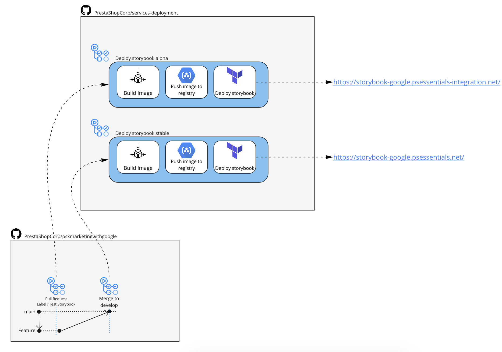

# Workflows

## Storybook

* Integration

To trigger storybook CI/CD, create a new pull request
Tag with label Storybook Test will trigger the workflow.

Storybook will be available at this following url : [storybook](https://storybook-google.psessentials-integration.net)

* Production

Production storybook CI/CD will automatically be triggered on push on develop.

Storybook will be available at this following url : [storybook](https://storybook-google.psessentials.net)

 
# Storage / CDN

Release and pre release will trigger a storage action on services-deployment.
This action will build vuejs project and push assets go GCP storage.

On pre release trigger, a new version will be stored and available at : https://storage.googleapis.com/psxmarketing-cdn/v1.1.1 (according to your tag name)

On release, 2 versions (major and minor) will be stored at :

* https://storage.googleapis.com/psxmarketing-cdn/v1.1.x
* https://storage.googleapis.com/psxmarketing-cdn/v1.x.x

